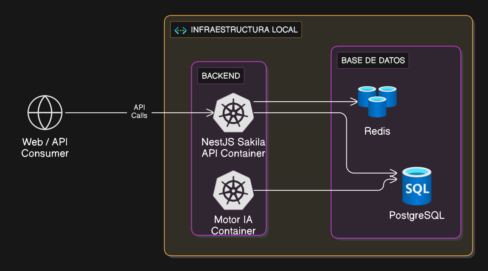

# INFO.md

## Descripción General del Proyecto

Este repositorio contiene una solución completa para un sistema de recomendaciones de películas basado en la base de datos Sakila. El sistema está compuesto por dos proyectos principales:

## Arquitectura Visual

<p align="center">
  
</p>

### 1. `motor_ia` (Python, FastAPI)

Microservicio de inteligencia artificial que implementa diferentes algoritmos de recomendación:

- **Por categorías/actores:** Basado en preferencias de géneros y reparto.
- **Fulltext:** Búsqueda semántica usando PostgreSQL Full-Text Search.
- **Machine Learning:** Recomendaciones personalizadas usando TF-IDF y similitud coseno.

### 2. `sakila-ai-api` (TypeScript, NestJS)

API principal que orquesta la lógica de negocio, expone endpoints REST y consume el microservicio de IA para recomendaciones avanzadas. Utiliza PostgreSQL (Prisma ORM) y Redis para cache.

## Arquitectura

- **Microservicios:** Separación clara entre lógica de negocio (NestJS) y lógica de IA (FastAPI).
- **Base de datos:** PostgreSQL con el esquema Sakila extendido.
- **Cache:** Redis para mejorar el rendimiento.
- **Contenedores:** Uso de Docker y docker-compose para facilitar el despliegue y la gestión de servicios.

## Pasos para el Despliegue y Funcionamiento

### 1. Requisitos previos

- Docker y docker-compose instalados
- Python 3.8+ y pip
- Node.js (recomendado usar NVM)

### 2. Despliegue automático (recomendado)

Ejecuta el script principal desde la raíz del proyecto:

```bash
./run.sh
```

Este script:

- Detiene cualquier contenedor Docker previo.
- Llama al lanzador de la API (`lanzar_run.sh`), que:
  - Pregunta si deseas limpiar y configurar el entorno desde cero.
  - Levanta los servicios Docker (PostgreSQL y Redis).
  - Instala dependencias Python y Node.js.
  - Genera la base de datos Sakila y sincroniza Prisma.
  - Espera a que los servicios estén "healthy" y deja el sistema listo para usar.

### 3. Acceso y pruebas

- La API principal estará disponible en: `http://localhost:3000/api` (Swagger UI)
- El microservicio de IA (FastAPI) suele correr en el puerto `2207`.
- Puedes probar los endpoints de recomendaciones, salud y machine learning desde Swagger o con herramientas como `curl` o Postman.

### 4. Notas adicionales

- El sistema soporta reinicio y limpieza automática de datos si así lo deseas.
- Toda la configuración de entorno se puede ajustar en los archivos `.env` y `.env.example`.
- Consulta los archivos `README.md` y documentación interna para detalles avanzados de cada módulo.

---

## Decisiones de Arquitectura y Diseño

Para conocer en detalle las decisiones tecnológicas, de diseño de modelo y los trade-offs realizados en este proyecto, consulta el archivo [DECISIONS.md](./DECISIONS.md).

---

Para dudas técnicas, revisa la documentación o contacta al equipo de desarrollo.
